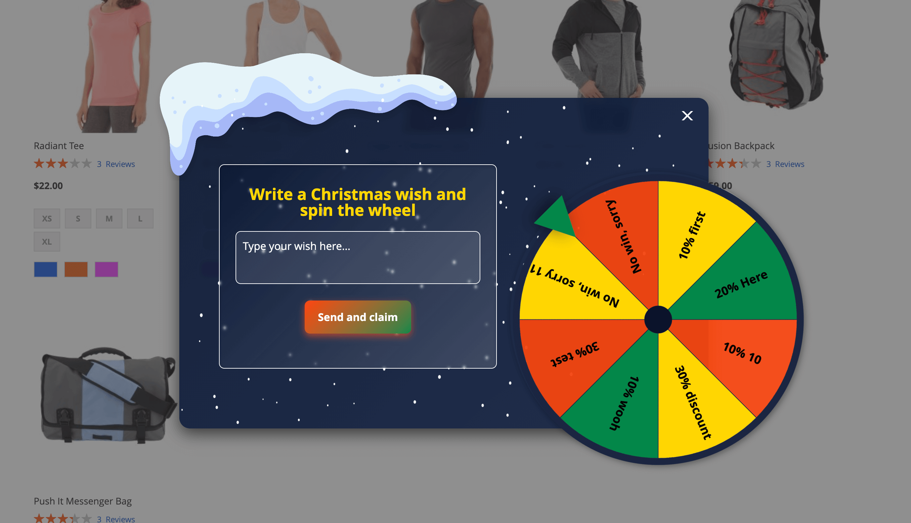

# Magento 2 Module: Christmas & New Year Wish with Lottery Wheel

This module for **Magento 2** implements the following functionality:  
A customer writes a Christmas or New Year wish, which is validated using a trained model (currently supports validation only for English greetings). After the wish is validated, the customer gets an opportunity to spin a lottery wheel and potentially win a discount, or they can receive a fixed discount for their wish (configurable in the admin panel).

Initial CTA modal


Main modal




---

## How to install a module

`composer require doroshko/wish-reward`

or

`git clone git@github.com:FrankieSR/WishReward.git app/code/Doroshko/WishReward`


then `bin/magento setup:upgrade`

---

## Features

1. **Wish Submission and Validation**  
   - Customers can write their Christmas or New Year wishes.
   - Wishes are validated using a trained machine learning model (currently supports English greetings only).

2. **Lottery Wheel Functionality**  
   - If enabled, customers can spin a lottery wheel with customizable sectors to win discounts.  

3. **Fixed Discount Option**  
   - If the lottery wheel is disabled, a fixed discount is applied based on a pre-configured cart price rule.

---

## Admin Settings

The module includes the following settings configurable in the Magento 2 admin panel:

### **General Settings**
1. **Enable Module**:  
   - Enables or disables the module.

2. **Enable Lottery Wheel**:  
   - Enables or disables the lottery wheel.  
   - If disabled, a fixed discount is applied based on the `Default Rule ID`.

3. **Default Rule ID**:  
   - Specifies the default cart price rule ID to apply if the lottery wheel is disabled.  

4. **Wheel Sectors**:  
   - Customizable sectors for the lottery wheel.  

---

### **Wheel Sectors Configuration**

The `Wheel Sectors` field allows you to define the sectors of the lottery wheel with the following customizable attributes:

- **label**: Text displayed on the sector (e.g., "10% Discount").
- **rule_id**: Cart price rule ID associated with the sector (null for non-winning sectors).
- **probability**: Probability of the sector being selected.  
- **color** *(optional)*: Custom color for the sector.

#### **Example Configuration**

```json
[
  {"label": "No win, sorry", "rule_id": null, "probability": 25},
  {"label": "10% coupon", "rule_id": 1, "probability": 20},
  {"label": "20% coupon", "rule_id": 2, "probability": 15},
  {"label": "10% coupon", "rule_id": 1, "probability": 20},
  {"label": "30%", "rule_id": 3, "probability": 5},
  {"label": "10%", "rule_id": 1, "probability": 20, "color": "red"},
  {"label": "30%", "rule_id": 3, "probability": 5},
  {"label": "No win, sorry", "rule_id": null, "probability": 25}
]
```
More details in app/code/Doroshko/WishReward/Model/ProbabilityCalculator.php
---

### **How Winning Probability is Calculated**

The winning sector is determined based on the **probability** value assigned to each sector. The formula used for calculating probabilities is based on **weighted random sampling**. For example:

```plaintext
Winning Sector = Weighted Random Selection of Sectors Based on Probabilities
```

Sectors with higher probability values are more likely to be selected.

---

### **How It Works**

1. **Wish Submission**:  
   - A customer writes a wish and submits it.  
   - The wish is validated to ensure it matches a Christmas or New Year greeting.

2. **Lottery Wheel (Optional)**:  
   - If enabled, the customer spins the lottery wheel.  
   - Based on the selected sector, a cart price rule is applied to generate a discount coupon.

3. **Fixed Discount (Optional)**:  
   - If the wheel is disabled, a fixed discount is applied using the `Default Rule ID`.

4. **Winning or Losing**:  
   - Sectors without a `rule_id` represent non-winning sectors. In such cases, a message is displayed indicating no discount was won.

---

## Installation and Configuration

1. **Install the module** in your Magento 2 environment.
2. Navigate to **Stores > Configuration > Wish Reward Settings** to configure the module:
   - Enable/Disable the module.
   - Configure the lottery wheel or set a default discount rule.
3. Customize the wheel sectors under **Wheel Sectors** with labels, rule IDs, probabilities, and optional colors.
4. Save the configuration and test the functionality on your storefront.

---

## Notes

- The module currently supports **English wish validation only**. Future updates may include support for additional languages.
- Ensure that the **cart price rules** referenced in `rule_id` are properly configured in the admin panel to apply discounts.

---

## License

This module is released under the MIT License.  
Feel free to use, modify, and distribute this module as needed.

---

Enjoy spreading festive joy with this interactive and engaging module for Magento 2! 🎄🎁

Contact: https://artem-doroshko.dev/